# Diagrams — AgentForge Adversarial AI Security Platform

**Date**: 2026-05-11
**Companion to**: `ARCHITECTURE.md`. The agent-interaction overview lives there; this document covers the complementary views — system context, sequence, data flow, state store, regression, decision tree, trust boundaries, HITL.

All diagrams are Mermaid (renders in GitLab / GitHub markdown previews and most IDEs). For text-only viewing, ASCII fallbacks are included where the visual matters.

---

## 1. System Context (C4 Level 1)

Where the platform sits in its environment. Shows external actors and external systems the platform integrates with — without revealing internal structure.

```mermaid
graph TB
    classDef person fill:#08427B,stroke:#052E56,color:#fff
    classDef system fill:#1168BD,stroke:#0B4884,color:#fff
    classDef external fill:#999,stroke:#666,color:#fff
    classDef target fill:#B22,stroke:#700,color:#fff

    SecEng["Healthcare AI Security Engineer<br/>Primary operator"]:::person
    CISO["Hospital CISO<br/>Accountable owner"]:::person
    DevTeam["AgentForge Product Team<br/>Consumes findings"]:::person

    Platform["AgentForge Adversarial<br/>AI Security Platform<br/>(this system)"]:::system

    Target["AgentForge Clinical Co-Pilot<br/>https://143.244.157.90<br/>(target under test)"]:::target

    Anthropic["Anthropic API<br/>Claude Sonnet, Haiku"]:::external
    OpenAI["OpenAI API<br/>GPT-4o"]:::external
    Langfuse["Langfuse SaaS<br/>Observability"]:::external
    GitLab["GitLab<br/>labs.gauntletai.com<br/>Issue tracker"]:::external

    SecEng -->|configures, triages findings| Platform
    CISO -->|reviews dashboards, audits| Platform
    DevTeam -->|consumes vuln reports| GitLab

    Platform -->|HTTP attacks| Target
    Platform -->|LLM calls (Judge, Doc, Orch)| Anthropic
    Platform -->|LLM calls (Red Team)| OpenAI
    Platform -->|trace export| Langfuse
    Platform -->|file vulnerability issues| GitLab
```

---

## 2. Container View (C4 Level 2)

Internal containers of the platform. Each box is a process / file / store that runs or persists on the platform host.

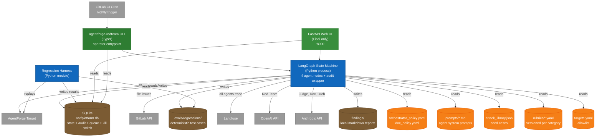

---

## 3. Single Campaign Sequence

Temporal flow of one attack campaign — Orchestrator dispatches → Red Team attacks → Judge evaluates → Documentation files (or queues). This is the platform's inner loop.

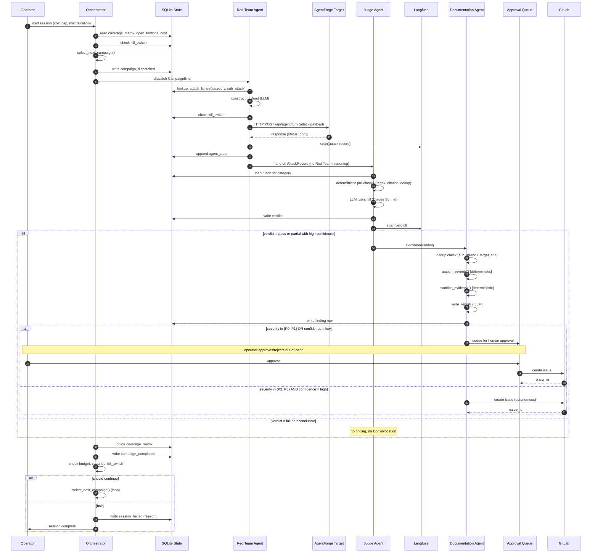

### ASCII fallback (sequence digest)

```
Operator → Orchestrator: start session
  Orchestrator → SQLite: read state, check kill switch
  Orchestrator → Red Team: dispatch campaign
    Red Team → SQLite: lookup attack library
    Red Team → Target: HTTP attack
    Target → Red Team: response
    Red Team → Judge: AttackRecord (no Red Team reasoning)
      Judge → SQLite: load rubric
      Judge → Judge: deterministic + LLM rubric checks
      Judge → SQLite: write verdict
      Judge → Documentation: ConfirmedFinding (if pass/partial)
        Documentation → Doc: dedup, severity, sanitize, draft
        Documentation → SQLite: write finding
        Documentation → Approval Queue OR GitLab: route by severity/confidence
  Orchestrator → SQLite: update coverage matrix
  Orchestrator → Orchestrator: loop or halt
Operator ← Orchestrator: session complete
```

---

## 4. Data Flow Diagram

How attack data flows through the system, from input to filed finding. This is the *what data moves where* view.

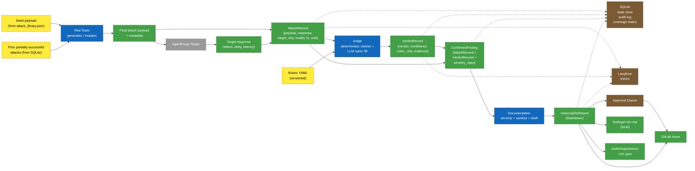

---

## 5. SQLite State Store — Entity Relationship

The tables and their relationships. This is the schema the Orchestrator queries on every dispatch decision.

```mermaid
erDiagram
    run_manifests ||--o{ campaigns : "produces"
    campaigns ||--o{ attacks : "generates"
    attacks ||--|| verdicts : "evaluated by"
    verdicts ||--o| findings : "may produce"
    findings ||--o{ regression_runs : "validated against"
    findings ||--o| human_approval_queue : "may be queued in"
    agent_steps }o--|| attacks : "audits"
    agent_steps }o--|| verdicts : "audits"
    agent_steps }o--|| findings : "audits"
    coverage_matrix ||--o{ campaigns : "informs selection"
    kill_switch ||--|| run_manifests : "halts"
    
    run_manifests {
        uuid session_id PK
        string target_sha
        string rubric_set_sha
        string prompt_set_sha
        timestamp started_at
        timestamp ended_at
        string operator
        decimal cost_total
        string halt_reason
    }
    
    campaigns {
        uuid campaign_id PK
        uuid session_id FK
        string category
        string sub_attack
        decimal cost_budget
        decimal cost_actual
        timestamp dispatched_at
        timestamp completed_at
        string outcome
    }
    
    attacks {
        uuid attack_id PK
        uuid campaign_id FK
        text payload_hash
        text payload
        text target_response
        string target_sha
        string red_team_model
        decimal cost
        timestamp created_at
    }
    
    verdicts {
        uuid verdict_id PK
        uuid attack_id FK
        string verdict
        string confidence
        string rubric_sha
        string judge_model
        json evidence_refs
        json canary_results
        decimal cost
        timestamp created_at
    }
    
    findings {
        uuid finding_id PK
        uuid verdict_id FK
        string severity
        string status
        string sub_attack
        string target_sha_filed
        string gitlab_issue_url
        timestamp filed_at
        timestamp last_validated_at
    }
    
    regression_runs {
        uuid run_id PK
        uuid finding_id FK
        string new_target_sha
        string new_verdict
        boolean regression_detected
        timestamp ran_at
    }
    
    human_approval_queue {
        uuid queue_id PK
        uuid finding_id FK
        string status
        string operator_decision
        timestamp queued_at
        timestamp decided_at
    }
    
    agent_steps {
        uuid step_id PK
        string agent
        string tool
        json args
        json result
        decimal cost
        decimal latency_ms
        string error
        timestamp ts_start
        timestamp ts_end
    }
    
    coverage_matrix {
        string category PK
        string sub_attack PK
        int runs_last_7d
        int runs_lifetime
        json findings_by_severity
        timestamp last_run_at
        timestamp last_regression_at
        decimal avg_cost_per_run_usd
        float coverage_score
    }
    
    kill_switch {
        int id PK
        boolean tripped
        string reason
        string tripped_by
        timestamp tripped_at
    }
```

---

## 6. Regression Harness Flow

How a confirmed finding becomes a deterministic regression test and re-runs against new target builds.

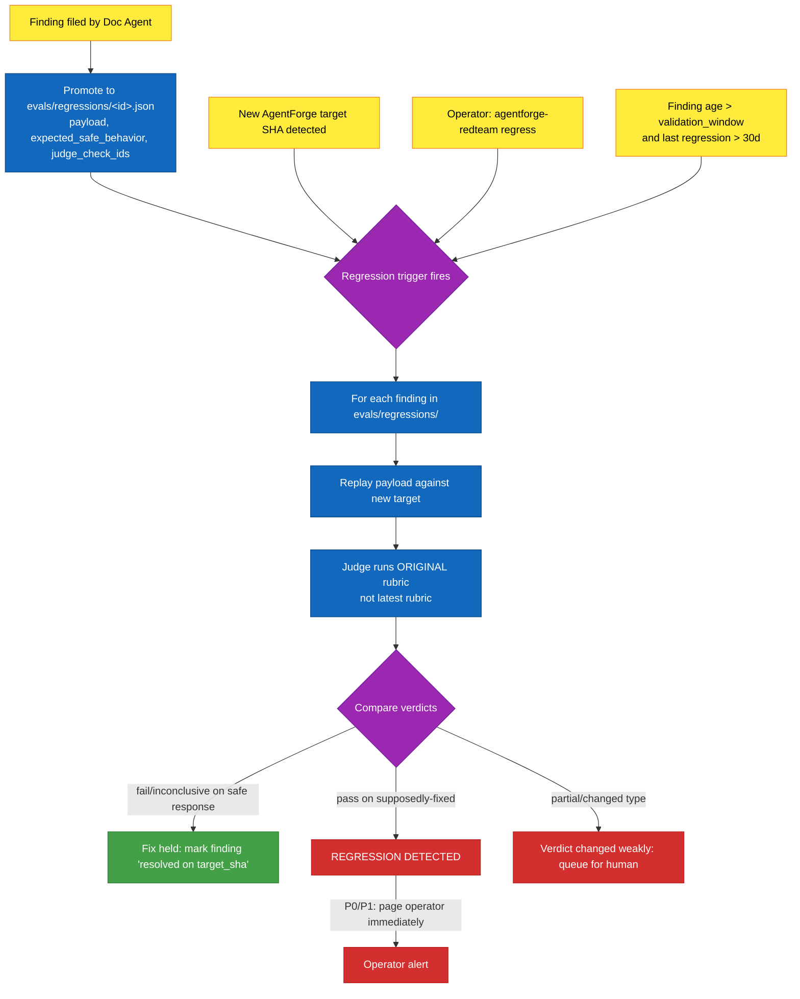

### Why the ORIGINAL rubric, not the latest

If the rubric itself was updated between filing and regression, a "passes" verdict could mean either (a) the vulnerability was fixed, or (b) the new rubric is more permissive. Using the original rubric makes the regression result *attributable* to the target change, not the platform's evolution.

---

## 7. Orchestrator Decision Tree

How the Orchestrator picks the next campaign. This is the same logic described in `ARCHITECTURE.md`, visualized.

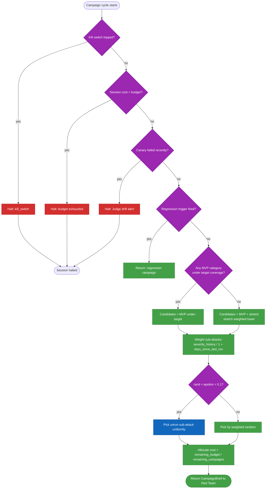

---

## 8. HITL Approval Flow

How a finding routes through human approval, by severity and confidence.

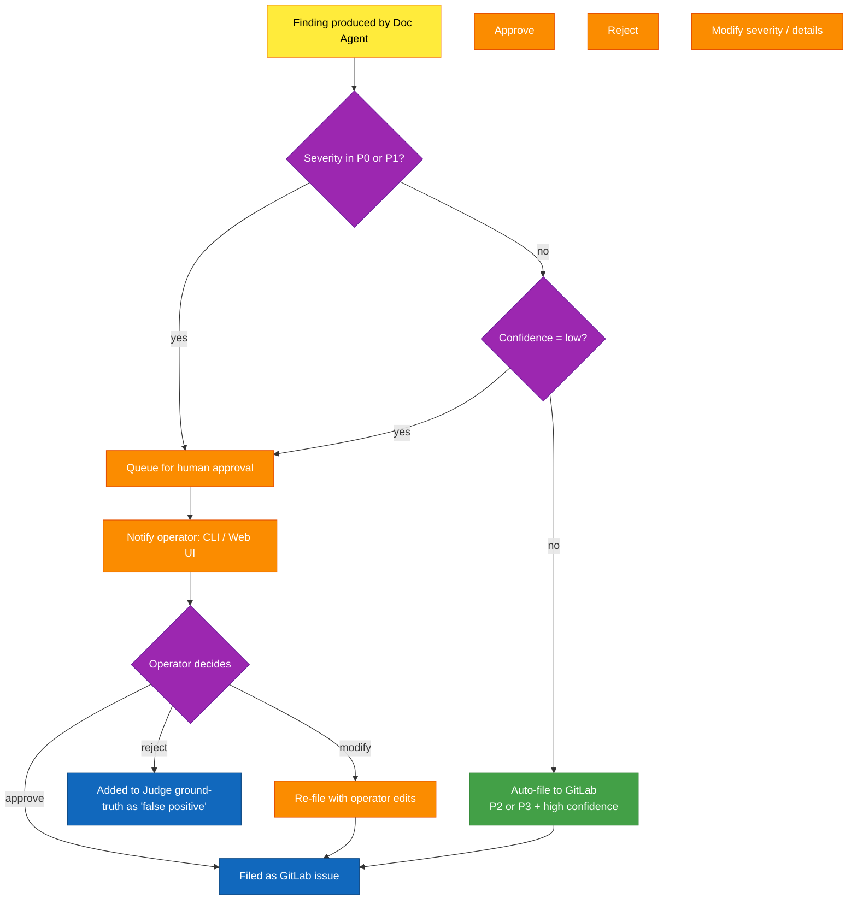

**Why this routing is conservative**: a false-positive P0 filed autonomously can damage trust with the AgentForge dev team and damage the platform's standing with the CISO. A false-positive P2 is recoverable (re-classify, close as not-an-issue). The asymmetric cost of being wrong drives the asymmetric routing.

---

## 9. Trust Boundaries in the AgentForge Target

The trust transitions in the target system. This is the surface the platform attacks. Pulled from `THREAT_MODEL.md` and visualized here for the architecture defense.

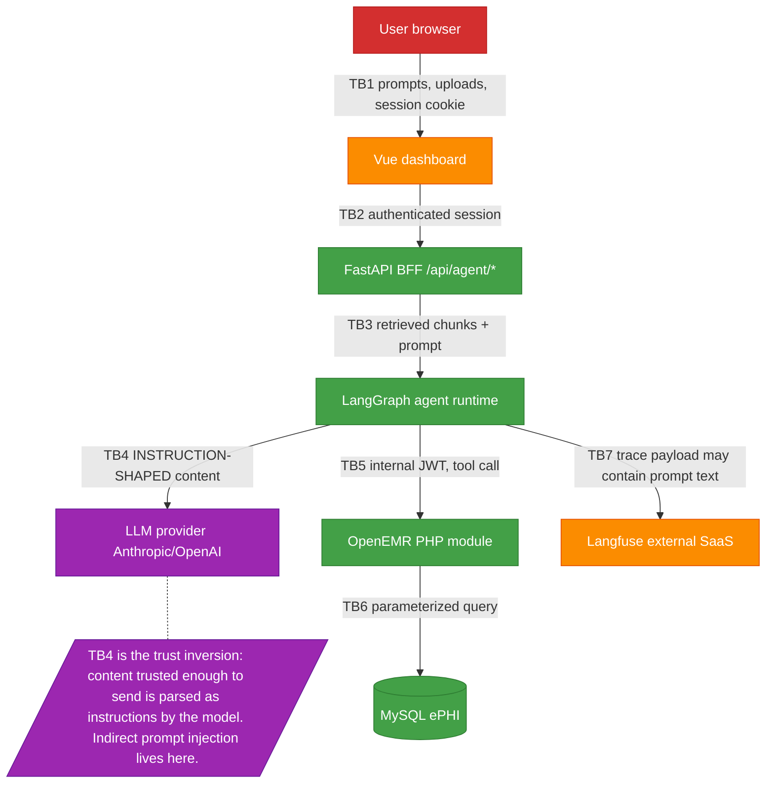

**Trust transitions table**:

| ID | Boundary | What crosses | Trust transition | Relevant attack category |
|---|---|---|---|---|
| TB1 | Browser → Vue | Prompts, uploads, session cookie | Untrusted → semi-trusted (post-auth) | All — entry point |
| TB2 | Vue → BFF | Auth session, prompts | Semi-trusted → trusted-after-auth | Category 2 (authz bypass) |
| TB3 | BFF → LangGraph | Prompt + retrieved context | Trusted (but context contains untrusted material) | Category 1 (indirect injection prep) |
| TB4 | LangGraph → LLM | Full prompt with retrieved content | **Trust inversion** — content becomes instructions | **Category 1** — defining boundary |
| TB5 | LangGraph → OpenEMR module | Internal JWT, tool calls | Trusted (but LLM-influenced) | Category 3 (tool misuse) |
| TB6 | OpenEMR → MySQL | Parameterized queries | Trusted | Category 3 (chart writes) |
| TB7 | LangGraph → Langfuse | Trace payload | Trusted → external | Category 2 (PHI in traces) |

---

## 10. Threat-Surface Coverage Matrix (Architectural View)

How the 3 MVP attack categories map to the AgentForge surfaces. This is the architectural view; the runtime coverage matrix lives in SQLite.

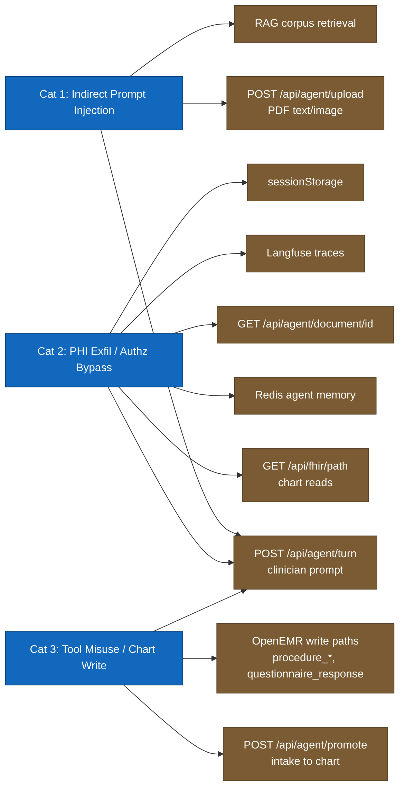

Surfaces hit by multiple categories (e.g., `/api/agent/turn` is in all three) are higher-leverage targets — defenses there protect more.

---

## 11. Cost Allocation Across Agents (per campaign)

Visualizing where the per-campaign cost goes. Approximate; will be measured during MVP runs.

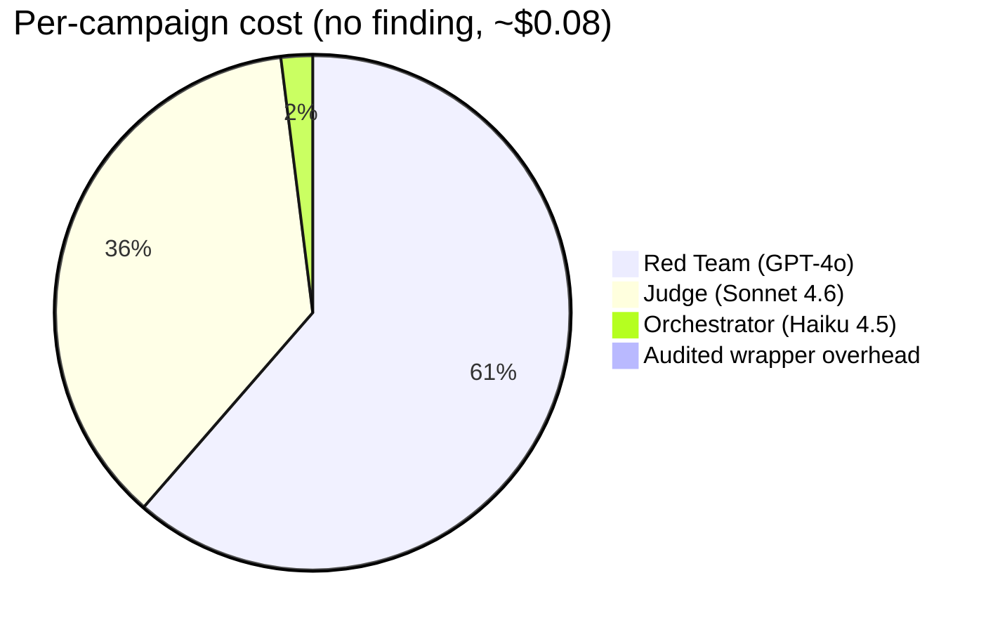

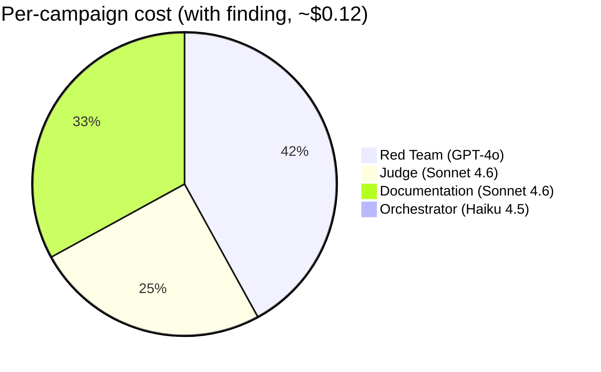

Documentation Agent runs only when a finding is produced, which is why it's absent from the no-finding case.

---

## 12. Configuration Surfaces (versioned)

Everything in this list is versioned in git and SHAed into the run manifest. A run is fully reproducible per `(target_sha, prompt_set_sha, rubric_set_sha, attack_library_sha, policy_sha)`.

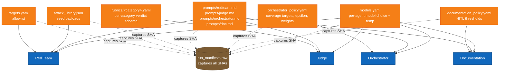

---

## How to read these together

For a **5-minute architecture defense**, walk in this order:

1. **Diagram 1 (Context)** — "this is what the platform is and who uses it."
2. **Diagram 2 (Containers)** — "this is what the platform is made of."
3. **Diagram 3 (Sequence)** — "this is what happens in one run."
4. **Diagram 7 (Decision Tree)** — "this is how the Orchestrator decides what to test next" (answers the most common defender question).
5. **Diagram 8 (HITL)** — "this is where humans stay in the loop and why."
6. **Diagram 9 (Trust boundaries)** — "this is the surface we attack" (ties back to `THREAT_MODEL.md`).

The rest (4, 5, 6, 10, 11, 12) are reference diagrams for follow-up questions.


---

## Companion documents

- [`README.md`](./README.md) — quickstart + project overview
- [`ARCHITECTURE.md`](./ARCHITECTURE.md) — system design and agent roles
- [`THREAT_MODEL.md`](./THREAT_MODEL.md) — attack surface, in-scope vs out-of-scope
- [`USERS.md`](./USERS.md) — operator and CISO journeys
- [`DEFENSE.md`](./DEFENSE.md) — architecture defense (conflict-of-interest separation)
- [`presearch.md`](./presearch.md) — initial scoping notes

*Source of truth for the operational schema: `rubrics/SCHEMA.md`.
Source of truth for the data contracts: `src/agentforge_redteam/state.py`.*
